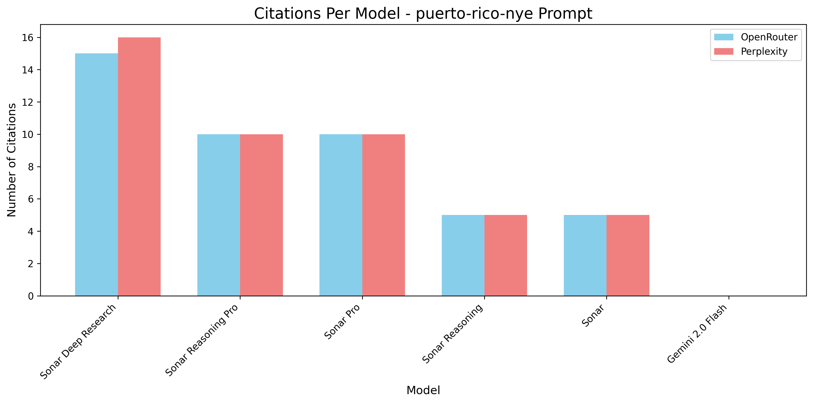

# Perplexity API Tests

A comprehensive testing framework for evaluating Perplexity AI's research-capable models across different API endpoints.

## Project Overview

This repository contains the results of experiments designed to test and compare Perplexity AI's research-capable models through different access methods. The primary goals of this experiment were:

1. **Test Recent Information Retrieval**: Evaluate how well different Perplexity models can retrieve information about a specific news event (Puerto Rico New Year's Eve disruption in 2024), testing their capabilities to access and process recent information beyond what's available in typical LLMs.

2. **Evaluate Research Capabilities**: Assess how effectively the models can provide well-researched responses with proper citations when asked about the relationship between income inequality and healthcare access.

3. **Debug Citation Issues**: Investigate why some models show citation placeholders without the actual citations in certain interfaces (like OpenWebUI), and determine whether this is an issue with the interface or the API responses.

4. **Compare API Access Methods**: Compare the performance and response quality of the same models when accessed through OpenRouter versus directly through Perplexity's API.

## Models Tested

### Perplexity Models (via OpenRouter and Direct API)
- perplexity/sonar-deep-research
- perplexity/sonar-reasoning-pro
- perplexity/sonar-pro
- perplexity/sonar-reasoning
- perplexity/sonar

### Control Model (via OpenRouter)
- google/gemini-2.0-flash-001

## Test Prompts

1. **Recent Information Retrieval Test**: "I heard that New Year's celebrations in Puerto Rico were severely disrupted on New Years Eve (December 31, 2024). What happened? Provide as many details as possible about the cause of the disruption."

2. **Research Capabilities Test**: "Explain the relationship between income inequality and access to healthcare in developed countries. Support each statement with citations to peer-reviewed studies containing relevant statistical data. Your explanation must be based solely on empirically verifiable data."

# API Test Results Summary

Generated on: 2025-04-03 00:17:35

Total prompts tested: 2
Total model results: 22

## Table of Contents

- [data-research](#data-research)
- [puerto-rico-nye](#puerto-rico-nye)

## Test Data Research Prompt

| Model | API | Words | Citations | Has Citations | Output Link |
|-------|-----|-------|-----------|---------------|-------------|
| google/gemini-2.0-flash-001 | OpenRouter | 1012 | 0 | No | [View Output](outputs/data-research_google-gemini-2.0-flash-001_openrouter.md) |
| perplexity/sonar | OpenRouter | 343 | 5 | Yes | [View Output](outputs/data-research_perplexity-sonar_openrouter.md) |
| perplexity/sonar | Perplexity | 350 | 5 | Yes | [View Output](outputs/data-research_perplexity-sonar_perplexity.md) |
| perplexity/sonar-deep-research | OpenRouter | 395 | 16 | Yes | [View Output](outputs/data-research_perplexity-sonar-deep-research_openrouter.md) |
| perplexity/sonar-deep-research | Perplexity | 821 | 16 | Yes | [View Output](outputs/data-research_perplexity-sonar-deep-research_perplexity.md) |
| perplexity/sonar-pro | OpenRouter | 575 | 10 | Yes | [View Output](outputs/data-research_perplexity-sonar-pro_openrouter.md) |
| perplexity/sonar-pro | Perplexity | 557 | 10 | Yes | [View Output](outputs/data-research_perplexity-sonar-pro_perplexity.md) |
| perplexity/sonar-reasoning | OpenRouter | 390 | 5 | Yes | [View Output](outputs/data-research_perplexity-sonar-reasoning_openrouter.md) |
| perplexity/sonar-reasoning | Perplexity | 896 | 5 | Yes | [View Output](outputs/data-research_perplexity-sonar-reasoning_perplexity.md) |
| perplexity/sonar-reasoning-pro | OpenRouter | 280 | 10 | Yes | [View Output](outputs/data-research_perplexity-sonar-reasoning-pro_openrouter.md) |
| perplexity/sonar-reasoning-pro | Perplexity | 743 | 10 | Yes | [View Output](outputs/data-research_perplexity-sonar-reasoning-pro_perplexity.md) |

## Test Time-Specific Prompt

| Model | API | Words | Citations | Has Citations | Output Link |
|-------|-----|-------|-----------|---------------|-------------|
| google/gemini-2.0-flash-001 | OpenRouter | 470 | 0 | No | [View Output](outputs/puerto-rico-nye_google-gemini-2.0-flash-001_openrouter.md) |
| perplexity/sonar | OpenRouter | 298 | 5 | Yes | [View Output](outputs/puerto-rico-nye_perplexity-sonar_openrouter.md) |
| perplexity/sonar | Perplexity | 287 | 5 | Yes | [View Output](outputs/puerto-rico-nye_perplexity-sonar_perplexity.md) |
| perplexity/sonar-deep-research | OpenRouter | 386 | 15 | Yes | [View Output](outputs/puerto-rico-nye_perplexity-sonar-deep-research_openrouter.md) |
| perplexity/sonar-deep-research | Perplexity | 710 | 16 | Yes | [View Output](outputs/puerto-rico-nye_perplexity-sonar-deep-research_perplexity.md) |
| perplexity/sonar-pro | OpenRouter | 276 | 10 | Yes | [View Output](outputs/puerto-rico-nye_perplexity-sonar-pro_openrouter.md) |
| perplexity/sonar-pro | Perplexity | 374 | 10 | Yes | [View Output](outputs/puerto-rico-nye_perplexity-sonar-pro_perplexity.md) |
| perplexity/sonar-reasoning | OpenRouter | 414 | 5 | Yes | [View Output](outputs/puerto-rico-nye_perplexity-sonar-reasoning_openrouter.md) |
| perplexity/sonar-reasoning | Perplexity | 789 | 5 | Yes | [View Output](outputs/puerto-rico-nye_perplexity-sonar-reasoning_perplexity.md) |
| perplexity/sonar-reasoning-pro | OpenRouter | 307 | 10 | Yes | [View Output](outputs/puerto-rico-nye_perplexity-sonar-reasoning-pro_openrouter.md) |
| perplexity/sonar-reasoning-pro | Perplexity | 788 | 10 | Yes | [View Output](outputs/puerto-rico-nye_perplexity-sonar-reasoning-pro_perplexity.md) |

## Key Findings

The experiment revealed several important insights:

1. **Citation Handling**: There are significant differences in how citations are handled between OpenRouter and direct Perplexity API access. Some models show citation placeholders ([1], [2], etc.) without providing the actual citations when accessed through OpenRouter.

2. **Information Retrieval Quality**: The models demonstrate varying capabilities in retrieving and synthesizing information about recent events, with the more advanced models generally providing more comprehensive and accurate information.

3. **API Response Structure**: The structure of API responses differs between OpenRouter and direct Perplexity access, which affects how citations and other metadata are presented in the final output.

4. **Model Comparison**: The experiment provides a clear comparison of the strengths and limitations of different Perplexity models, helping to identify which models are best suited for specific types of research and information retrieval tasks.

## Data Visualizations

The following visualizations provide a clear comparison of the models' performance across different metrics.

### Citations Per Model

#### All Tests Combined


#### Data Research Prompt


#### Time-Specific (Puerto Rico) Prompt


### Word Count Per Model

#### All Tests Combined


#### Data Research Prompt


#### Time-Specific (Puerto Rico) Prompt


## Repository Structure

- `test-prompts/`: Contains the test prompts used in the experiment
- `outputs/`: Contains the outputs from all model and API combinations
- `debug_logs/`: Contains raw API responses for debugging citation issues
- `test_apis.py`: Main script for running tests across all models and APIs
- `test_single_model.py`: Script for targeted testing of specific model/API combinations
- `generate_summary.py`: Script for generating a summary of test results

## Usage

To run the tests yourself:

1. Clone this repository
2. Install dependencies: `pip install -r requirements.txt`
3. Create a `.env` file with your API keys:
   ```
   OPENROUTER_API_KEY="your_openrouter_api_key"
   PERPEXITY_API_KEY="your_perplexity_api_key"
   ```
4. Run the tests:
   ```
   ./test_apis.py
   ```

For more specific testing options:
```
./test_apis.py --help
